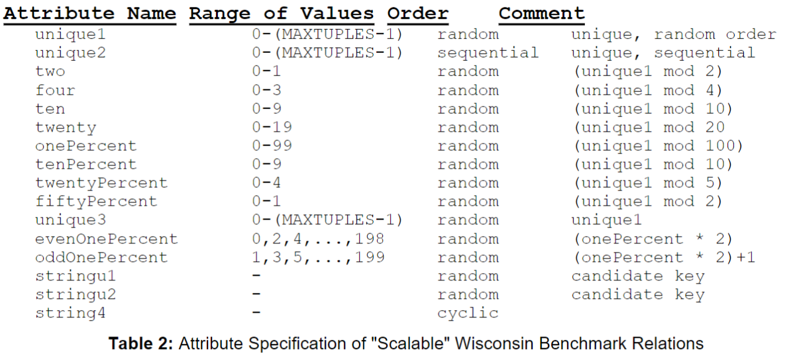
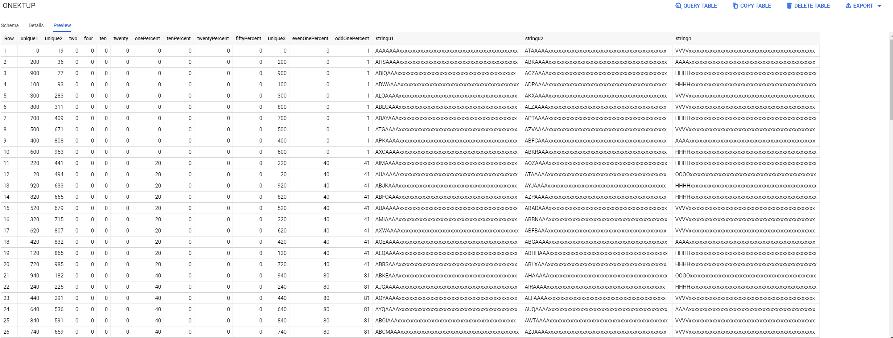
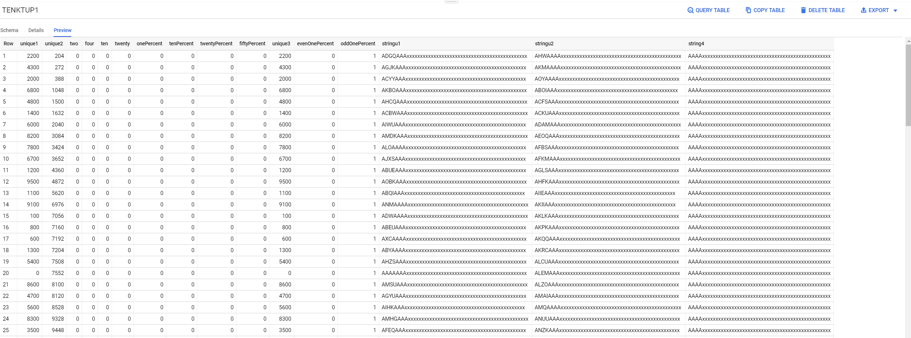
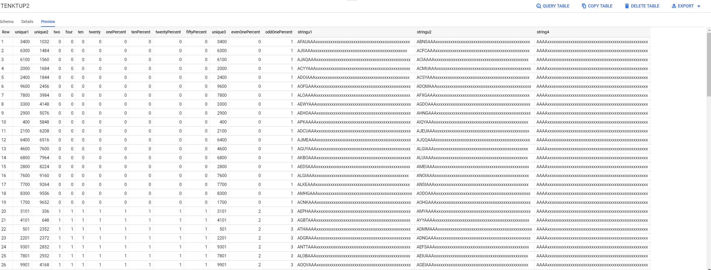

# CS487-Project-Part1
by Zhi and Jianqiang Hao
## Brief description of our work
The first part of the project is mainly a reference to the steps of an implementation program that will generate a valid Wisconsin benchmark data set and have an understanding of the data in the database. Then we load the csv files generated by the program into BigQuery provided by Google Cloud and PostgreSql provided by PSU.

## DBMS selection
So far, we decide to work mainly on Google Cloud Platform, and also take postgresql as comparison.
We choose GCP because it's a commonly used platform with many covenient tools, and we haven't used it before, so it could be a good oppotunity to learn about it during this course, and the reason that we choose postgresql is we have some expereience using it during the previous course.

## Load data into system
* The generated date is based on the "scalable" version of relation in the Wisconsin Benchmark paper.

* Load ONEKTUP into Google Cloud Platform

* Load TENKTUP1 into Google Cloud Platform

* Load TENKTUP2 into Google Cloud Platform

## Issues encountered
We've encountered issue that the column name can't be loaded by GCP when load the data into it, but fixed by adding a new line contains the column name at the beginning of the csv file.

## references:
http://jimgray.azurewebsites.net/benchmarkhandbook/chapter4.pdf
